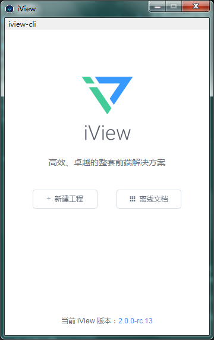
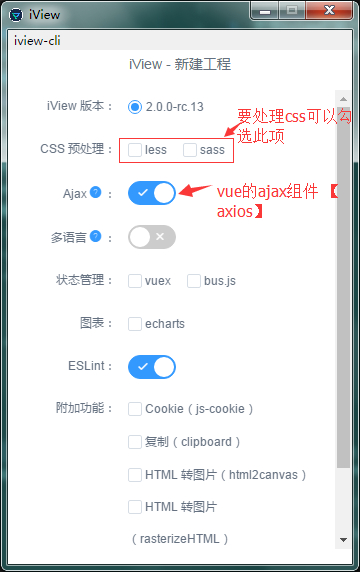
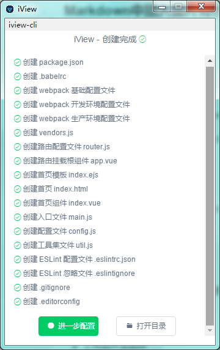
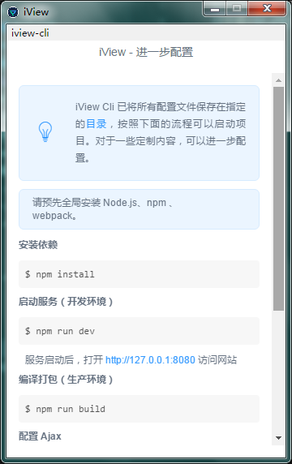
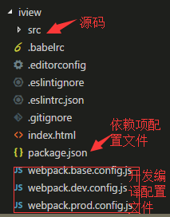
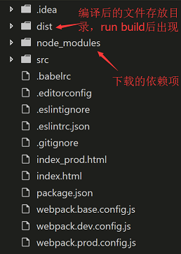
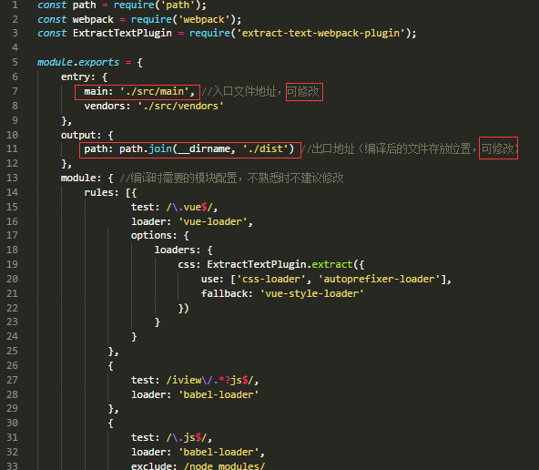
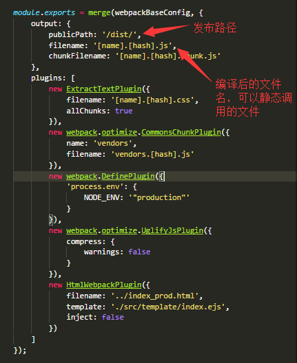

# iView的使用入门
## 一、项目创建
### 1. 使用iview的[官方下载的客户端](https://www.iviewui.com/cli) **新建工程**


### 2. 进行项目的配置,然后选择“**创建工程**”并设置保存位置




### 3. 进行进一步配置，配置前请确认已经安装好了**node.js**、**npm**、 和 **webpack**。

    npm install cnpm -g //npm安装较慢，可以使用国内镜像加快速度，不在意的可以跳过此步骤（-g为全局安装）

    npm install webpack -g 或者 cnpm install webpack -g //安装webpack，用来做打包（能编译node下编写的js，并压缩）

----
安装完成后，按照**提示步骤**运行即可。

## 二、 项目目录

##### 未执行依赖项安装前目录



##### 安装完成后目录


### 1. package.json文件
##### 文件内包含项目依赖项，执行 npm install 命令时需要此文件。
```
{
  "name": "", //项目名
  "version": "1.0.0", //项目版本号
  "description": "",
  "main": "index.js", //入口文件（相当于main函数所在文件）
  "scripts": {
    "init": "webpack --progress --config webpack.dev.config.js",
    "dev": "webpack-dev-server --content-base ./ --open --inline --hot --compress --history-api-fallback --config webpack.dev.config.js", //开发脚本配置，在控制台执行 npm run dev 时的代码
    "build": "webpack --progress --hide-modules --config webpack.prod.config.js", //编译发布环境时执行的代码，在控制器执行 npm run build时执行的命令
    "lint": "eslint --fix --ext .js,.vue src"
  },
  "repository": {
    "type": "git",
    "url": ""
  },
  "author": "",
  "license": "MIT",
  "dependencies": {
      //下面是步骤2配置时选择的依赖项
    "vue": "^2.2.6",
    "vue-router": "^2.3.1",
    "iview": "^2.0.0-rc.13",
    "axios": "^0.15.3",
    "vuex": "^2.2.1",
    "echarts": "^3.4.0",
    "js-cookie": "^2.1.3",
    "clipboard": "^1.5.12",
    "html2canvas": "^0.5.0-beta4",
    "rasterizehtml": "^1.2.4"
  },
  "devDependencies": {
    "autoprefixer-loader": "^2.0.0",
    //babel模块可以将es6的代码转变成浏览器可以识别的js
    "babel": "^6.23.0",
    "babel-core": "^6.23.1",
    "babel-loader": "^6.2.4",
    "babel-plugin-transform-runtime": "^6.12.0",
    "babel-preset-es2015": "^6.9.0",
    "babel-runtime": "^6.11.6",
    //cssloader可以处理css
    "css-loader": "^0.23.1",
    "extract-text-webpack-plugin": "^2.0.0",
    "file-loader": "^0.8.5",
    "html-loader": "^0.3.0",
    "html-webpack-plugin": "^2.28.0",
    "style-loader": "^0.13.1",
    "url-loader": "^0.5.7",
    "vue-hot-reload-api": "^1.3.3",
    "vue-html-loader": "^1.2.3",
    "vue-loader": "^11.0.0",
    "vue-style-loader": "^1.0.0",
    "vue-template-compiler": "^2.2.1",
    "webpack": "^2.2.1",
    "webpack-dev-server": "^2.4.1",
    "webpack-merge": "^3.0.0",
    //es的格式检测模块
    "eslint": "^3.12.2",
    "eslint-plugin-html": "^1.7.0"
  }
}
```
### 2. webpack.base.config.js 编译、打包的基本配置文件，其他的两个文件都 **继承** 自此文件


### 3. webpack.prod.config.js 打包配置文件，此文件在执行 npm run build 命令时读取调用，设置了打包后的文件地址；dev文件类似；

